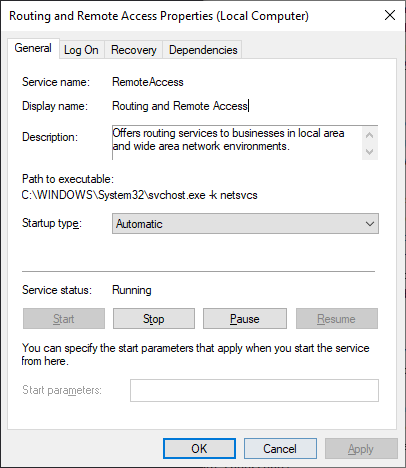
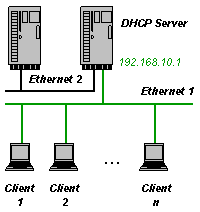

# Creating Static Routes in Windows

## Contents

- [Enable IP Routing](#enable-ip-routing)
- [Add a Static Route](#add-a-static-route)
- [Examples](#examples)
  - [Example Network Setup](#example-network-setup)
  - [Example DHCP Server for Windows Config](#example-dhcp-server-for-windows-config)
  - [Routing Traffic Between Two Networks](#routing-traffic-between-two-networks)

## Enable IP Routing

1. First, open **regedit**:
  - Press **Win** + **R**
  - Type `regedit`
  - Press **Enter**
2. Go to `HKEY_LOCAL_MACHINE` > `SYSTEM` > `CurrentControlSet` > `Services` > `Tcpip` > `Parameters` > `IP Enable Router`
3. Change the `Value Data` from `0` to `1`.
4. Open the **Windows Services Manager**:
  - Press **Win** + **R**
  - Type `services.msc`
  - Press **Enter**
5. Find **Routing and Remote Access**, right click on it, and press **Properties**.
   Change the `Startup Type` to `Automatic`:

   

## Add a Static Route

Static routes can be added to Windows using the
[route](https://learn.microsoft.com/en-gb/windows-server/administration/windows-commands/route_ws2008)
command. See the Microsoft documentation for the full help.

The following commands should be run in an **Administrator PowerShell** window.

The `route add` command is used to add a static route as follows:

```PowerShell
route [/f] [/p] [<command> [<destination>] [mask <netmask>] [<gateway>] [metric <metric>]] [if <interface>]]
```

_Note: Arguments in square brackets `[]` are optional._

- `/f`: Clears the routing table of all routes that are not host routes, the loopback
        network route, or a multicast route.
- `/p`: When used with the `add` command, it makes the route persistent. When used with
        the `print` command, it displays the list of persistent routes.
- `<command>`: The command to run; either `add`, `change`, `delete`, or `print`.
  - `add`: Add a route.
  - `change`: Modify an existing route.
  - `delete`: Deletes a route or multiple routes.
  - `print`: Prints a route or multiple routes.
- `<destination>`: The network destination of the route.
- `<netmask>`: Specifies the network destination subnet mask.
               Defaults to `255.255.255.255`.
- `<gateway>`: Specifies the forwarding IP address over which the network destination and
               subnet mask are reachable. For locally attached subnet routes, this is the
               IP address assigned to the interface attached to the subnet.
- `<metric>`: Integer cost metric (between `1` and `9999`) of using the route. This is
              used when choosing among multiple routes that match a given destination
              address. The route with the lowest metric is chosen.
- `<interface>`: The interface index over which the destination is reachable. To list the
                 interfaces and their indexes, use `route print`.
- `/?`: Displays the command help.

## Examples

### Example Network Setup

The examples here will be based on the following network setup, from **Example 2** of
the [DHCP Server for Windows](https://www.dhcpserver.de/cms/ini_file_overview/)
documentation:

|  |
|:--------------------------------------------------------------:|
| *Image from https://www.dhcpserver.de/cms/ini_file_overview/*  |

The following should be noted about this network, and adjusted accordingly for your
network:
- **Ethernet 1** is assigned a static IP of `192.168.1.1`.
- **Ethernet 1** is running [DHCP Server for Windows](https://www.dhcpserver.de/cms/).
- The DHCP server on **Ethernet 1** tells clients the Gateway is `192.168.1.2`, and
  that the DNS server is `192.168.1.3`.
- **Ethernet 2** is connected to a local network, and is assigned an IP address
  by a DHCP server.
- **Ethernet 2** has a Router at `10.75.0.1`, and a DNS server at `10.75.0.100`.

**Ethernet 1** is controlled locally by you, and can be configured by setting a
static IP address in Control Pannel (under Network Adapter Properties). The rest
is configured by [DHCP Server for Windows](https://www.dhcpserver.de/cms/) in
`dhcpsrv.ini`.

You can find the relevant information about **Ethernet 2** while connected to it
using `ipconfig /all`, and looking for the relevant network interface:

```PowerShell
Ethernet adapter Ethernet 1:

   Connection-specific DNS Suffix  . :
   Description . . . . . . . . . . . : Intel(R) Ethernet Connection (4) I219-LM
   Physical Address. . . . . . . . . : AA-BB-CC-DD-EE-FF
   DHCP Enabled. . . . . . . . . . . : No
   Autoconfiguration Enabled . . . . : Yes
   IPv4 Address. . . . . . . . . . . : 192.168.1.1(Preferred)
   Subnet Mask . . . . . . . . . . . : 255.255.255.0
   Default Gateway . . . . . . . . . :

Ethernet adapter Ethernet 2:

   Description . . . . . . . . . . . : Dell Giga Ethernet
   Physical Address. . . . . . . . . : AA-BB-CC-DD-EE-FF
   DHCP Enabled. . . . . . . . . . . : Yes
   Autoconfiguration Enabled . . . . : Yes
   IPv4 Address. . . . . . . . . . . : 10.75.0.18(Preferred)
   Subnet Mask . . . . . . . . . . . : 255.255.255.0
   Lease Obtained. . . . . . . . . . : 12 July 2023 09:17:53
   Lease Expires . . . . . . . . . . : 12 July 2023 17:17:51
   Default Gateway . . . . . . . . . : 10.75.0.1
   DHCP Server . . . . . . . . . . . : 10.75.0.50
   DHCPv6 IAID . . . . . . . . . . . : 312757448
   DHCPv6 Client DUID. . . . . . . . : 00-11-22-33-44-55-66-77-88-99-AA-BB-CC-DD
   DNS Servers . . . . . . . . . . . : 10.75.0.100
                                       10.75.0.101
```

### Example [DHCP Server for Windows](https://www.dhcpserver.de/cms/) Config

This example should work, but for additional customisation see the
[DHCP Server for Windows documentation](https://www.dhcpserver.de/cms/ini_file_overview/).
This is based off of **Example 2**.

```ini
[GENERAL]
; Subnet mask common across all clients.
SUBNETMASK=255.255.255.0
; Router IP for IPBIND_1. This will be used as a gateway for the "route" command.
ROUTER_1=192.168.1.2
; DNS server for IPBIND_1. This will be used as a gateway for the "route" command.
DNS_1=192.168.1.3

[SETTINGS]
; Associate the IP pools with the respective IP binds. This will prevent
; the DHCP server from serving clients on Ethernet 2.
AssociateBindsToPools=1
; Bind to the adapter with the name "Ethernet 1". This is the interface that the DHCP
; server will run on.
IPBIND_1="Ethernet 1"
; DHCP clients on interface IPBIND_1 will be assigned an address from this pool.
IPPOOL_1=192.168.1.4-254
```

### Routing Traffic Between Two Networks

This can be used to allow devices on **Ethernet 1** to access the internet connection
provided by **Ethernet 2**. Both of the following commands will provide a persistent
route. When testing configurations, simply drop the `-p` flag so that a reboot will
remove the routes.

Gateway traffic can be routed from `192.168.1.2` to `10.75.0.1` with the following
command:

```PowerShell
route -p add 10.75.0.1 192.168.1.2
```

This will forward any traffic destined for the gateway to the gateway on **Ethernet 2**.

DNS traffic can be routed from `192.168.1.3` to `10.75.0.100` with the following command:

```PowerShell
route -p add 10.75.0.100 192.168.1.3
```

This will forward the DNS queries to the DNS on **Ethernet 2**. With both of these
routes, devices on **Ethernet 1** can now access the internet through the connection
on **Ethernet 2**.
